# **Note Calculator for Desmos**

## Description
A calculator that takes music notes in letter notation (both English and German) and creates a range of notes along with a list of sounds to copy and paste into Desmos. 
By using Desmos' tone function, it can play the song using the frequencies provided by the calculator. 
Inspired by seeing various songs created in Desmos as a fun side project, I decided to create my own. To make the process easier, I wrote a script that generates the songs for me. Once I finished, I thought it would be a great idea to share it with my friends and others who might also want to create songs in Desmos but don't want to spend countless hours learning how to do it.

## Technologies:

</img>

<a href='https://www.desmos.com/calculator'></img></a>

Built with Python 3.13

## HOW TO
To use the program, you need to have Python installed. If you need help installing Python, here is a guide on how to do it:
https://realpython.com/installing-python/#windows-how-to-install-python-using-the-official-installer

After installing Python, move the program to your Python folder and launch it using the `run.bat` file.

#### Calculator

1. Enter the lowest note used in the song (e.g., c2).
 

 
2. Enter the highest note used in the song (e.g., c4).
 
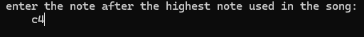
 
3. The definition of different note frequencies from the given range will be generated as a list, which you will paste into Desmos. This process is further explained in the Desmos tutorial below.
   
4. Manually enter the notes separated by commas into the program. Add pauses between notes to ensure they sound correctly. (A pause is always added automatically after each note to make the change in sound clear.)
   
5. Once you have finished entering the notes, type `0` to end the program.
 
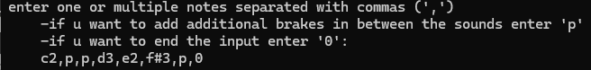
 

6. Paste the lines into Desmos as explained in the tutorial below.

#### Desmos

*The order in which you paste lines into Desmos does **not** matter.*
1. Copy the output line by line into Desmos as shown below:

 > **WARNING! Note frequency definitions (`f(x) = {...}`) may paste the braces in incorrect positions (or may not paste them at all). You will need to fix this manually by adding the opening brace `{` after the `=` sign, the closing brace `}` at the end of the entire list, and removing the last comma in the list before the closing brace.**
 
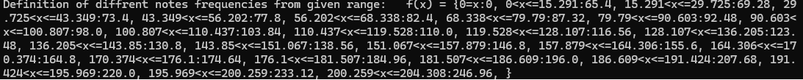
 
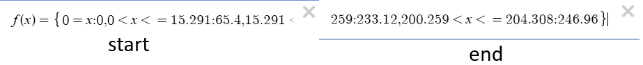
 

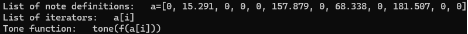
 
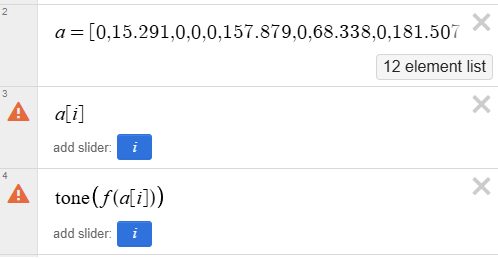
 
2. Create the variable sliders suggested by Desmos (click on the small icons to add sliders).
 

 
3. To set up the song correctly, adjust the speed and the range of the variable sliders. The number after the 'length of smaller segments' represents the maximum value. The minimum value for the first slider should be set to 1, and for the next sliders, it should be set to 0.
 
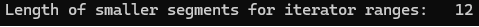
 
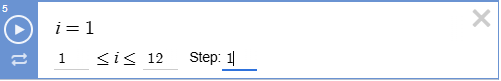
 
4. To adjust the speed, open the slider settings (the icon under the 'play button') and reduce the speed to match your song's tempo. Change the animation mode to 'Play Once.'
 
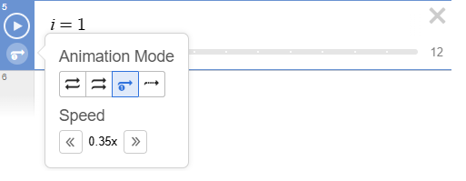
 
5. Enable sound at the top of the page by clicking the speaker icon.
 
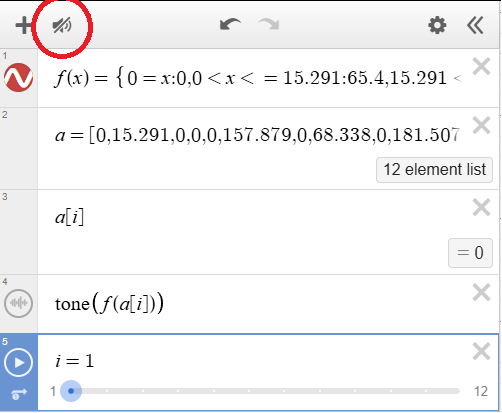
 
**If you have more sliders it will look like this:**
 
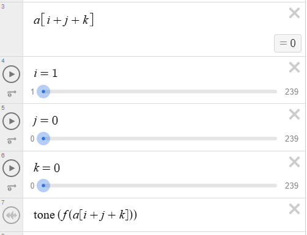
 
After finishing all the steps, hit play on the first slider and when it ends, start the next one and so on. If the song does not sound right, try editing some settings or adding more pauses in the program.
Have fun making your songs and show off to your friends and family that you can do math :)).

